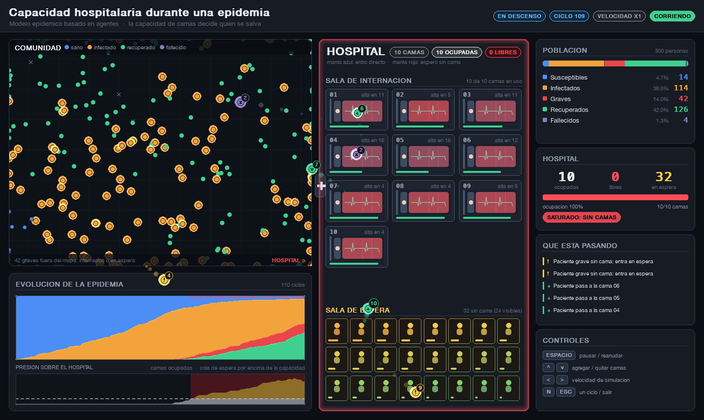

<div align="center">

# 🏥 hospital-capacity-simulation

**Simulación por agentes de una epidemia con capacidad hospitalaria limitada, construida en Pygame.**

[](https://www.python.org/)
[](https://pyga.me/)
[](https://pandas.pydata.org/)
[](tests/)
[](LICENSE)

**Elizabeth Correa Suárez · Juan Sebastián Ortega Muñoz**

</div>

---

## 📑 Tabla de contenidos

1. [Introducción](#-introducción)
2. [La pregunta de decisión](#-la-pregunta-de-decisión)
3. [Estructura del proyecto](#-estructura-del-proyecto)
4. [Qué hace cada clase](#-qué-hace-cada-clase)
5. [Cómo funciona el código internamente](#-cómo-funciona-el-código-internamente)
6. [Las 3 formas de ejecutar el proyecto](#-las-3-formas-de-ejecutar-el-proyecto)
7. [Cómo se ejecuta](#-cómo-se-ejecuta)
8. [La interfaz](#-la-interfaz)
9. [Parámetros del modelo](#-parámetros-del-modelo)
10. [Resultados (Excel)](#-resultados-excel)
11. [Análisis](#-análisis)
12. [Conclusiones](#-conclusiones)
13. [Límites del modelo](#-límites-del-modelo)
14. [Tests](#-tests)

---

## 📖 Introducción

Este proyecto es un entregable de un curso universitario de Inteligencia Artificial. Consiste en una **simulación por agentes** construida con [Pygame](https://www.pygame.org/) (usando el fork `pygame-ce`) que modela la propagación de una epidemia en una población de personas que se mueven libremente por una pantalla.

A diferencia de una simulación SIR clásica (susceptible → infectado → recuperado), este modelo agrega un estado adicional: **grave**. Una persona grave necesita una cama de hospital, y el hospital tiene **capacidad limitada**. Cuando la demanda de camas supera la oferta, los pacientes graves quedan en una lista de espera, y el tiempo que pasan esperando afecta directamente su probabilidad de sobrevivir.

El proyecto incluye:

- Visualización en tiempo real de la epidemia con controles interactivos (pausa, capacidad de camas, velocidad).
- Exportación de resultados a Excel (`openpyxl` + `pandas`) con hojas de evolución temporal y de resumen comparativo entre escenarios.
- Un análisis cuantitativo que responde a la pregunta de decisión del proyecto con evidencia numérica.

---

## ❓ La pregunta de decisión

> **¿Cómo afecta la capacidad hospitalaria (número de camas) a la mortalidad, la saturación del sistema y la cantidad de pacientes sin atención durante una epidemia?**

Esta es la pregunta que el proyecto busca responder. Importa porque, en una epidemia real, el número de camas disponibles no es algo que se pueda ajustar de un día para el otro: es una decisión de planeamiento con consecuencias directas sobre cuánta gente recibe atención a tiempo. El proyecto la responde ejecutando la misma epidemia con distinto número de camas (5, 10 y 20) y comparando los resultados con evidencia cuantitativa, en vez de intuición.

---

## 🗂️ Estructura del proyecto

```
hospital-capacity-simulation/
├── config.py
├── person.py
├── hospital.py
├── simulation.py
├── theme.py
├── renderer.py
├── exporter.py
├── main.py
├── requirements.txt
├── requirements-dev.txt
├── LICENSE
├── README.md
├── tests/
│   ├── test_person.py
│   ├── test_hospital.py
│   ├── test_simulation.py
│   ├── test_controls.py
│   ├── test_renderer.py
│   ├── test_exporter.py
│   └── test_main.py
└── resultados/
    └── comparacion_camas.xlsx
```

| Archivo / carpeta | Qué hace |
|---|---|
| [`config.py`](config.py) | Constantes compartidas por todo el proyecto: el área lógica donde se mueven los agentes, los FPS de la ventana y los ciclos por segundo del modelo. |
| [`person.py`](person.py) | Clase `Person`: agente individual, su posición, estado epidemiológico y movimiento. |
| [`hospital.py`](hospital.py) | Clase `Hospital`: administra las camas disponibles y la lista de espera FIFO. |
| [`simulation.py`](simulation.py) | Clase `Simulation`: motor central que coordina a las personas y al hospital, avanza la lógica ciclo a ciclo y maneja la ventana de Pygame. |
| [`theme.py`](theme.py) | Paleta, tipografías y primitivas de dibujo (tarjetas, barras, halos, píldoras). Es lo único que define cómo se ve la interfaz. |
| [`renderer.py`](renderer.py) | Clase `Renderer`: arma cada frame (mapa, hospital con sus camas, gráficos y panel) y anima los traslados de pacientes. |
| [`exporter.py`](exporter.py) | Convierte `simulation.history` en un archivo Excel (`.xlsx`) con hojas de evolución temporal, resumen y promedios, más gráficos embebidos. |
| [`main.py`](main.py) | Punto de entrada: define los parámetros del modelo y arma la simulación en uno de los tres modos de ejecución. |
| [`tests/`](tests/) | Suite de tests (`pytest`) para la lógica, los controles, el renderizado, la exportación y el parseo de argumentos. |
| [`resultados/`](resultados/) | Carpeta donde se generan los `.xlsx` del modo comparación (ya contiene `comparacion_camas.xlsx`). |
| [`requirements.txt`](requirements.txt) / [`requirements-dev.txt`](requirements-dev.txt) | Dependencias de ejecución y de desarrollo (tests). |
| [`LICENSE`](LICENSE) | Licencia MIT del proyecto. |

---

## 🧩 Qué hace cada clase

### `Person` — [`person.py`](person.py)

Representa a un individuo dentro de la simulación: guarda su posición, su estado de salud y un temporizador reutilizable para las transiciones de estado.

**Atributos principales:** `x`, `y` (posición), `state` (`susceptible` / `infected` / `grave` / `recovered` / `dead`), `hospitalized` (si ocupa una cama), `timer` (ciclos hasta el próximo cambio de estado), `cycles_waiting` (ciclos que pasó grave sin conseguir cama), `vx`/`vy` (vector de velocidad persistente).

| Método | Qué hace |
|---|---|
| `infect(duration)` | Pasa de sano a infectado y arranca el conteo de ciclos hasta el próximo cambio de estado. |
| `tick()` | Avanza el temporizador en uno; devuelve `True` cuando llega a cero, avisando que toca aplicar la siguiente transición. |
| `set_grave(duration)` | Agrava a la persona infectada (ahora necesita hospitalización) y reinicia el temporizador y el contador de espera. |
| `recover()` | Marca a la persona como recuperada y libera su cama si tenía una asignada. |
| `die()` | Marca a la persona como fallecida y libera su cama si tenía una asignada. |
| `move(width, height, step, random_fn)` | Actualiza la posición sumando una velocidad persistente con inercia (no salta a un punto al azar cada ciclo); recorta la magnitud a `step` y mantiene a la persona dentro de los límites de la pantalla. |

### `Hospital` — [`hospital.py`](hospital.py)

Administra las camas disponibles y la lista de espera de pacientes graves.

**Atributos principales:** `capacity` (camas totales), `occupied` (camas ocupadas), `waiting_list` (`collections.deque` con los pacientes en espera, en orden de llegada). Además expone las propiedades `free_beds` (camas libres) e `is_saturated` (si no quedan camas libres).

| Método | Qué hace |
|---|---|
| `admit(person)` | Ingresa a una persona si hay cama libre; si no la hay, la agrega al final de la lista de espera. |
| `discharge(person)` | Da de alta a una persona (libera su cama) y, si hay alguien esperando, le asigna esa cama de inmediato al primero de la fila. |
| `set_capacity(new_capacity)` | Cambia la capacidad total. Aumentarla siempre se permite; reducirla se rechaza si dejaría a menos camas que pacientes ya ocupándolas. Al subir la capacidad, reasigna automáticamente a quien esté esperando si queda cupo. Devuelve `True`/`False` según si el cambio se aplicó. |
| `remove_from_waiting_list(person)` | Saca a una persona de la lista de espera (se usa cuando alguien se recupera o fallece mientras esperaba). |

### `Simulation` — [`simulation.py`](simulation.py)

Es el motor central del proyecto: crea la población inicial, avanza el estado de cada persona ciclo a ciclo, gestiona los ingresos y altas del hospital, dibuja todo en pantalla y guarda un historial por ciclo para la exportación a Excel.

**Atributos principales:** los parámetros del modelo recibidos en el constructor (ver [tabla de parámetros](#-parámetros-del-modelo)), más `hospital` (instancia de `Hospital`), `people` (lista de `Person`), `history` (lista de snapshots por ciclo), `paused`, `speed` y `current_cycle`.

**Métodos de lógica:**

| Método | Qué hace |
|---|---|
| `_validate_params(...)` *(estático)* | Valida los parámetros del constructor y lanza `ValueError` con un mensaje claro si alguno está fuera de rango. |
| `populate()` | Genera la población inicial en posiciones aleatorias, infecta a las primeras `initial_infected` personas y registra el primer snapshot del historial. |
| `_infect(person)` | Marca a una persona como contagiada e inicia su periodo de infección. |
| `_infection_expire(person)` | Se ejecuta al vencer el periodo de infección leve: según `pct_grave`, decide si la persona se agrava (e intenta hospitalizarla) o se recupera directamente. |
| `_grave_mortality(person)` | Calcula la probabilidad de que un paciente grave fallezca, interpolando entre `mortality_hospitalized` y `mortality_waiting` según el tiempo que pasó sin cama (ver [sección 5](#-cómo-funciona-el-código-internamente)). |
| `_grave_expire(person)` | Se ejecuta al vencer el periodo crítico de un paciente grave: aplica `_grave_mortality` y decide si fallece o se recupera. |
| `_recover(person)` | Marca a una persona como recuperada, liberando su cama o sacándola de la lista de espera según corresponda. |
| `_record_history()` | Guarda en `self.history` un resumen del estado actual: cantidad de personas por estado, ocupación de camas, gente en espera y si el hospital está saturado. |
| `update()` | Avanza la simulación un ciclo completo (ver desglose en la [sección 5](#-cómo-funciona-el-código-internamente)). |
| `_spread_contagion()` | Revisa a las personas infectadas y decide, según distancia y probabilidad de contagio, quién se enferma en ese ciclo. |
| `_in_contagion_range(source, other)` | Indica si `other` está sana y lo bastante cerca de `source` como para poder contagiarse. |
| `is_finished()` | Indica si ya no queda nadie `infected` ni `grave` en la simulación. |

**Métodos de presentación (ventana de Pygame):**

`Simulation` ya no dibuja: decide *cuándo* se dibuja y delega el *cómo* en [`renderer.py`](renderer.py).

| Método | Qué hace |
|---|---|
| `handle_event(event)` | Responde a las teclas: pausar (`ESPACIO`), subir/bajar camas (`↑`/`↓`, de a 5 con `SHIFT`), velocidad (`←`/`→`) y avanzar un solo ciclo en pausa (`N`). |
| `_state_counts()` | Cuenta cuánta gente hay en cada estado en el momento actual. |
| `_renderer()` | Devuelve el `Renderer`, creándolo la primera vez que se dibuja (el modo comparación nunca lo instancia). |
| `_scaled(frame, size)` | Escala el lienzo al tamaño de la ventana reutilizando siempre la misma superficie destino. |
| `draw(screen)` | Pide un frame al renderer y lo ajusta a `screen`, sea cual sea su tamaño. |
| `_window_size()` *(estático)* | Calcula el tamaño inicial de la ventana: el lienzo completo si entra en la pantalla, o la mayor reducción proporcional que sí entre. |
| `run()` | Inicializa Pygame y ejecuta el loop principal (eventos → ciclos pendientes → `draw()`) hasta que se cierra la ventana o se presiona `ESC`. |

### `Renderer` — [`renderer.py`](renderer.py)

Dibuja cada frame sobre un lienzo de tamaño fijo (1440×860) que después se escala a la ventana, así el diseño no depende de la resolución del monitor.

La particularidad del renderer es que **la lógica del modelo no le avisa nada**: `Renderer.sync()` compara el estado actual de la simulación con el del frame anterior y deduce solo qué pasó (quién ingresó, quién pasó de la espera a una cama, quién recibió el alta, si se agregaron o quitaron camas). Eso permitió sumar toda la capa visual sin tocar una línea de `Person`, `Hospital` ni del `update()` de `Simulation`.

| Método | Qué hace |
|---|---|
| `sync(sim)` | Compara con el frame anterior y genera animaciones, entradas del registro y asignaciones de cama. |
| `_sync_beds(sim, capacity)` | Detecta altas e ingresos. Procesa **primero las altas**: liberan camas que en ese mismo ciclo puede ocupar quien ingresa. |
| `_sync_queue(sim)` | Detecta quién entra a la sala de espera y quién la deja sin haber conseguido cama nunca. |
| `_sync_capacity(sim, capacity)` | Anima las camas que se habilitan o se retiran y muda a quien quedaba en una cama que dejó de existir. |
| `_reconcile_beds(sim, capacity)` | Red de seguridad: deja el mapa de camas idéntico a lo que dice el hospital, incluso si entraron muchos ciclos en un mismo frame. |
| `bed_layout(capacity)` | Elige cuántas columnas usar y de qué tamaño dibujar cada cama para que entren todas en la sala. |
| `field_pos(sim, person)` | Traduce las coordenadas del modelo a píxeles del mapa. |
| `render(sim)` | Devuelve el lienzo con el frame completo: encabezado, mapa, gráficos, hospital, panel, traslados y avisos. |

---

## ⚙️ Cómo funciona el código internamente

### El ciclo de `update()`

Cada llamada a `Simulation.update()` (si la simulación no está pausada) hace, en orden:

1. Incrementa `current_cycle` en uno.
2. Para cada persona **viva** (`state != "dead"`):
   - La mueve (`Person.move`).
   - Si está `grave` y no tiene cama, suma un ciclo a `cycles_waiting`.
   - Si está `infected` y su temporizador vence (`tick()` devuelve `True`), llama a `_infection_expire`.
   - Si está `grave` y su temporizador vence, llama a `_grave_expire`.
3. Llama a `_spread_contagion()` para calcular los contagios nuevos de ese ciclo.
4. Llama a `_record_history()` para guardar el snapshot del ciclo en `self.history`.

### Cómo se decide el contagio

`_spread_contagion()` recorre a todas las personas `infected` (fuentes) y, por cada una, revisa a todas las demás personas. Si otra persona está `susceptible` y a una distancia ≤ `infection_radius` de la fuente, se sortea `random_fn() < transmission_probability` para decidir si se contagia. Los nuevos contagios se acumulan en un `set` y se aplican **todos al final** del método — así una persona recién contagiada en este ciclo no puede a su vez contagiar a otras en el mismo ciclo.

### Cómo se asignan y liberan camas

El hospital usa una lista de espera FIFO real (`collections.deque`), con una sola regla de asignación: **orden de llegada**.

- `admit(person)`: si hay camas libres, ocupa una; si no, la persona se agrega al final de `waiting_list`.
- `discharge(person)`: libera la cama de quien se retira (por alta o por fallecimiento) y, si hay alguien esperando, le asigna esa cama de inmediato al primero de la fila (`popleft()`).
- `set_capacity(n)`: subir la capacidad siempre se permite y reasigna camas a quien esperaba si queda cupo disponible; bajarla se rechaza si dejaría camas ocupadas por debajo de cero (es decir, si `n < occupied`).

### Mortalidad según tiempo de espera

Cuando el temporizador de un paciente `grave` vence, `_grave_expire` decide si muere o se recupera. La probabilidad de morir la calcula `_grave_mortality`, y **no depende solo de si el paciente tiene cama en el instante exacto del vencimiento**: se interpola según qué fracción de su periodo crítico (`grave_duration`) pasó sin atención.

```python
if not person.hospitalized:
    return self.mortality_waiting

sin_atencion = min(person.cycles_waiting / self.grave_duration, 1.0)
return (self.mortality_hospitalized
        + sin_atencion * (self.mortality_waiting - self.mortality_hospitalized))
```

En los extremos, esto coincide con lo intuitivo: alguien que nunca esperó (`cycles_waiting = 0`) usa exactamente `mortality_hospitalized`; alguien que jamás consiguió cama usa `mortality_waiting`. Entre esos dos extremos, el riesgo crece linealmente con el tiempo pasado sin atención. `_grave_expire` sortea `random_fn() < mortality` para decidir el desenlace y libera la cama o saca a la persona de la lista de espera según corresponda.

---

## ▶️ Las 3 formas de ejecutar el proyecto

El bloque `if __name__ == "__main__":` de [`main.py`](main.py) decide el modo según los argumentos de línea de comandos:

| Comando | Qué hace | Cuándo usarlo |
|---|---|---|
| `python main.py` | Modo **interactivo** con ventana de Pygame, usando la semilla fija `SEED = 42` (`_resolve_seed` sin `--random`). | Para ensayar o grabar una demo reproducible: la corrida es siempre la misma. |
| `python main.py --random` | Modo **interactivo**, pero `_resolve_seed` sortea una semilla nueva en cada corrida (`random.randint(0, 999_999)`). | Para ver epidemias distintas en cada ejecución, en vez de repetir siempre la misma. |
| `python main.py --comparar [--reps N]` | Modo **comparación**: corre, sin ventana, un escenario por cada valor de `BED_SCENARIOS = (5, 10, 20)`, cada uno `N` veces (`--reps`, por defecto `REPETICIONES = 5`) con semillas consecutivas a partir de `SEED`, y exporta todo a `resultados/comparacion_camas.xlsx`. | Para generar la evidencia cuantitativa que responde la pregunta de decisión. Con `--reps 1` se hace una sola corrida por escenario. |

En el modo comparación, `run_headless()` corre cada escenario ciclo a ciclo (sin dibujar nada) hasta que `sim.is_finished()` es `True`, con un corte de seguridad en `MAX_CYCLES = 5000` por si la epidemia nunca se apagara.

---

## 🚀 Cómo se ejecuta

### 1. Crear y activar un entorno virtual

```bash
python -m venv .venv
source .venv/bin/activate      # en Windows: .venv\Scripts\activate
```

### 2. Instalar dependencias

Para correr la simulación ([`requirements.txt`](requirements.txt): `pygame-ce`, `numpy`, `pandas`, `openpyxl`):

```bash
pip install -r requirements.txt
```

Para además correr los tests ([`requirements-dev.txt`](requirements-dev.txt) agrega `pytest` sobre lo anterior):

```bash
pip install -r requirements-dev.txt
```

> Se usa `pygame-ce` (fork mantenido de `pygame`) en vez de `pygame`. Se importa igual (`import pygame`).

### 3. Ejecutar

```bash
# Modo interactivo, semilla fija (demo reproducible)
python main.py

# Modo interactivo, semilla aleatoria en cada corrida
python main.py --random

# Modo comparación: genera resultados/comparacion_camas.xlsx (5 repeticiones por escenario)
python main.py --comparar

# Modo comparación, una sola corrida por escenario
python main.py --comparar --reps 1
```

### Controles del modo interactivo

| Tecla | Acción |
|---|---|
| `ESPACIO` | Pausar / reanudar. |
| `↑` / `↓` | Subir / bajar camas de a una. La cama aparece o desaparece con una animación en la sala. Bajar se rechaza si dejaría pacientes sin cama. |
| `SHIFT` + `↑` / `↓` | Lo mismo, de a 5 camas. |
| `←` / `→` | Bajar / subir la velocidad de la simulación (x1 a x10). |
| `N` | Con la simulación en pausa, avanzar un solo ciclo (útil para explicar un momento puntual). |
| `ESC` | Salir. |

La ventana es redimensionable: la interfaz se dibuja sobre un lienzo fijo y se escala, así que se ve igual en cualquier tamaño.

---

## 🖼️ La interfaz



*Ciclo 120 de la corrida por defecto (semilla 42, 10 camas): el hospital está saturado, las 10 camas ocupadas y 39 pacientes graves esperando afuera.*

La pantalla está pensada para que **se entienda qué está pasando sin leer el código ni la documentación**. Se divide en cuatro bloques:

### 1. Comunidad (mapa, arriba a la izquierda)

Cada punto es una persona moviéndose:

| | Estado |
|---|---|
| 🔵 azul | **Susceptible**: sana, puede contagiarse. |
| 🟠 naranja con halo | **Infectado**: contagia a quien pase cerca. |
| 🟢 verde | **Recuperado**: inmune, ya no participa de la epidemia. |
| ✕ violeta apagado | **Fallecido**: deja de moverse. |

Cuando alguien se contagia, un **anillo naranja se expande** en el lugar exacto donde ocurrió, así se ve la epidemia propagarse en vez de solo cambiar de color.

Los pacientes **graves no aparecen en el mapa**: salieron de la comunidad y están en el hospital, internados o esperando. El pie del mapa siempre dice cuántos son.

### 2. Hospital (columna del medio)

Es el bloque central de la simulación y muestra cada cama **una por una**:

- **Sala de internación**: una grilla con todas las camas numeradas. Una cama libre está vacía y apagada; una ocupada muestra al paciente acostado (almohada, cabeza y manta), un **monitor cardíaco animado** y, en el pie, una **barra verde** que avanza a medida que pasa su periodo crítico, con el texto `alta en N` indicando cuántos ciclos le faltan.
- **El color de la manta cuenta su historia**: azul si consiguió cama apenas se agravó, cada vez más roja cuanto más tiempo esperó sin atención — que es exactamente lo que determina su probabilidad de morir.
- **Sala de espera**: los pacientes graves que no encontraron cama, en orden de llegada. Cada uno tiene una barra de deterioro que va de verde a rojo según los ciclos que lleva esperando.
- Cuando se agregan o quitan camas con `↑`/`↓`, **la cama aparece o desaparece en la grilla** con un destello verde o rojo.
- Si el hospital se satura, todo el bloque se rodea de un **contorno rojo que late**.

### 3. Traslados (animaciones que cruzan la pantalla)

Cada movimiento de un paciente se dibuja como un token que viaja en arco, con su estela y su etiqueta:

| Traslado | Qué significa |
|---|---|
| `INGRESA A CAMA` | Se agravó y había cama libre: va del mapa directo a su cama. |
| `SIN CAMA: ESPERA` | Se agravó con el hospital lleno: va del mapa a la sala de espera. |
| `PASA A CAMA` | Se liberó una cama y le tocaba a él: va de la sala de espera a la cama. |
| `ALTA: RECUPERADO` | Superó el periodo crítico: sale de la cama y vuelve a la comunidad. |
| `FALLECE` / `FALLECE ESPERANDO` | Murió en la cama o antes de conseguirla. |
| `CAMBIO DE CAMA` | Se redujo la capacidad y su cama dejó de existir. |

En el pico de la epidemia se mueven varios pacientes por ciclo. Animar cada uno por separado llenaba la pantalla de tokens cruzándose, así que **los traslados del mismo tipo se agrupan**: mientras uno está en curso, los siguientes se suman a él y el token muestra un contador (`×7`). En vez de 40 puntos disparados a la vez se ven 6 o 7 traslados legibles, cada uno diciendo a cuánta gente representa.

El panel **«Qué está pasando»** sí deja por escrito cada movimiento por separado, con el número de cama concreto, y las entradas viejas se van apagando.

### 4. Gráficos y panel (abajo a la izquierda y a la derecha)

- **Evolución de la epidemia**: área apilada con la composición de la población en cada ciclo. La banda azul de arriba se va comiendo, la ola naranja pasa por el medio y el verde se acumula abajo. Las marcas rojas del borde superior son los ciclos en que el hospital estuvo lleno.
- **Presión sobre el hospital**: camas ocupadas y, por encima de la línea punteada de capacidad, la cola de espera. El fondo rojo marca los tramos de saturación: es el gráfico que responde la pregunta del proyecto de un vistazo.
- **Población**: barra apilada y conteo por estado, con porcentajes.
- **Hospital**: ocupadas / libres / en espera, la barra de ocupación y el aviso de saturación.

Al terminar la epidemia aparece sobre el mapa un **resumen final** con recuperados, fallecidos y cuántos ciclos estuvo saturado el hospital.

---

## 🎛️ Parámetros del modelo

`SIM_PARAMS`, definido en [`main.py`](main.py), son los parámetros del modelo que se mantienen **iguales en los tres escenarios** del modo comparación — lo único que cambia entre corridas es la capacidad de camas:

| Parámetro | Valor | Qué significa |
|---|---|---|
| `population` | `300` | Cantidad total de personas de la población. |
| `initial_infected` | `5` | Cuántas personas arrancan infectadas al llamar a `populate()`. |
| `transmission_probability` | `0.10` | Probabilidad de que un infectado contagie a un susceptible dentro de su radio de contagio, en cada ciclo. |
| `infection_radius` | `45` | Distancia máxima (en píxeles) para considerar que dos personas están en contacto. |
| `pct_grave` | `0.30` | Probabilidad de que un infectado pase a estado grave al vencer `infection_duration`. |
| `infection_duration` | `60` | Ciclos que dura el estado `infected` antes de resolverse (grave o recuperado). |
| `grave_duration` | `40` | Ciclos que dura el estado `grave` antes de resolverse (fallecido o recuperado). |
| `mortality_hospitalized` | `0.15` | Probabilidad de morir al vencer `grave_duration` si estuvo hospitalizado todo ese tiempo. |
| `mortality_waiting` | `0.60` | Probabilidad de morir al vencer `grave_duration` si nunca consiguió cama. |

Otras constantes relevantes de `main.py`, fuera de `SIM_PARAMS`:

| Constante | Valor | Qué significa |
|---|---|---|
| `BED_SCENARIOS` | `(5, 10, 20)` | Capacidades de hospital que se comparan en el modo `--comparar`. |
| `SEED` | `42` | Semilla base: fija para el modo interactivo por defecto y punto de partida de las semillas del modo comparación. |
| `INTERACTIVE_BEDS` | `10` | Capacidad inicial del hospital en el modo interactivo. |
| `REPETICIONES` | `5` | Repeticiones por escenario en el modo comparación, salvo que se pase `--reps`. |
| `MAX_CYCLES` | `5000` | Corte de seguridad de ciclos en `run_headless()` por si una epidemia no se apagara nunca. |

---

## 📊 Resultados (Excel)

`python main.py --comparar` genera `resultados/comparacion_camas.xlsx` (ya incluido en el repositorio) con las siguientes hojas, construidas por [`exporter.py`](exporter.py):

| Hoja | Contenido |
|---|---|
| `resumen` | Una fila por cada corrida individual: parámetros del escenario + resultados agregados (ciclos simulados, contagiados totales, fallecidos, recuperados, tasas de mortalidad/letalidad, picos de infectados/graves/ocupación/espera, espera acumulada, ciclos con pacientes sin cama, ciclos saturado y % del tiempo saturado). |
| `promedios` *(solo si hay más de una repetición por escenario)* | Promedia las filas de `resumen` que comparten capacidad de camas, con la cantidad de repeticiones incluida. Incluye dos gráficos de barras: **fallecidos según capacidad hospitalaria** y **ciclos con hospital saturado**. |
| `timeline_run_N` *(una por corrida)* | Evolución ciclo a ciclo de la corrida N: cantidad de personas en cada estado, hospitalizados, en espera, camas ocupadas/libres, capacidad y si estaba saturado. Incluye un gráfico de líneas con la evolución de infectados, graves, hospitalizados, en espera y fallecidos. |

Resumen numérico, promediando 5 corridas por escenario (semillas 42 a 46, las mismas para las tres capacidades):

| | 5 camas | 10 camas | 20 camas |
|---|---|---|---|
| **Fallecidos** | 34.0 | 23.6 | **13.0** |
| Mortalidad sobre la población | 11% | 8% | 4% |
| Letalidad entre contagiados | 12% | 8% | 5% |
| Contagiados totales | 275.8 | 281.6 | 287.2 |
| Pico de pacientes graves simultáneos | 31.0 | 31.4 | 31.0 |
| Pico de pacientes sin cama | 26.0 | 21.4 | 11.0 |
| Personas que esperaron cama | 73.2 | 63.8 | 24.8 |
| Espera promedio (ciclos, de 40) | 28.4 | 19.1 | 9.8 |
| Espera acumulada (persona-ciclo) | 2120 | 1227 | 296 |
| **% del tiempo con el hospital saturado** | 66% | 54% | **14%** |

---

## 🔍 Análisis

Puntos principales:

- **La capacidad no cambia cuánta gente se enferma, cambia cuánta se muere.** El pico de pacientes graves es prácticamente idéntico en los tres escenarios (~31), porque la epidemia genera la misma demanda de camas sin importar cuántas haya. Lo que varía es cuántos de esos pacientes reciben atención a tiempo.
- **El mecanismo es el tiempo sin atención.** La gravedad dura 40 ciclos. Con 5 camas, un paciente grave pasa en promedio 28.4 de esos 40 ciclos sin cama (71% del periodo crítico); con 20 camas, baja a 9.8 ciclos (25%). Como la mortalidad se interpola según esa fracción, la diferencia de tiempo de espera se traduce directamente en la diferencia de fallecidos.
- **La saturación no desaparece ni con 20 camas.** El hospital sigue saturado el 14% del tiempo, con un pico de 11 pacientes sin cama. El pico de demanda (~31 graves simultáneos) es más del 10% de la población total.
- **Rendimientos decrecientes.** Pasar de 5 a 10 camas evita ~10.4 muertes (2.08 por cama agregada); pasar de 10 a 20 evita una cantidad similar (~10.6 muertes) pero con el doble de camas (1.06 por cama). Las primeras camas agregadas a un sistema colapsado valen más que las últimas.
- **Efecto contraintuitivo.** Los contagiados totales suben levemente con más camas (275.8 → 287.2) y la epidemia dura más, porque al morir menos gente quedan más personas vivas circulando y contagiándose.

---

## ✅ Conclusiones

> Con la misma epidemia y la misma cantidad de enfermos, pasar de 5 a 20 camas reduce las muertes un **62%** (34 → 13) y el tiempo de saturación del 66% al 14%. El mecanismo es el tiempo de espera: con 5 camas un paciente grave pasa el 71% de su periodo crítico sin atención, contra el 25% con 20 camas. Aun así, ni con 20 camas el sistema deja de saturarse, y las primeras camas que se agregan salvan el doble de vidas por cama que las últimas.

En otras palabras: en este modelo, **la capacidad hospitalaria no es una herramienta de prevención de contagios, es una herramienta de supervivencia** para quienes ya se enfermaron gravemente.

---

## ⚠️ Límites del modelo

Qué NO representa este modelo:

- **Las probabilidades son parámetros del modelo, no cifras clínicas reales.** `pct_grave`, `mortality_hospitalized` y `mortality_waiting` se eligieron para estudiar el efecto de un recurso limitado, no para representar ninguna enfermedad específica.
- **Única regla de asignación de camas: orden de llegada (FIFO).** El proyecto no implementa otras estrategias (priorizar por vulnerabilidad, por probabilidad de recuperación, etc.); eso está explícitamente fuera de alcance.
- **El hospital es abstracto.** Es un contador de camas, sin ubicación física, médicos, enfermeros, ventiladores ni traslados entre hospitales. La cama es el único recurso escaso del modelo.
- **5 repeticiones por escenario son pocas.** Alcanzan para que la tendencia general se sostenga (una sola corrida por escenario puede invertir la comparación por azar), pero la dispersión entre semillas sigue siendo grande. Para afirmaciones más finas harían falta muchas más corridas.
- **La mortalidad interpolada según tiempo sin atención es un supuesto del modelo**, no un dato observado. Es una elección de diseño para que la capacidad hospitalaria tenga un efecto real sobre la mortalidad, no una regla derivada de evidencia clínica.
- **No hay calibración con datos reales** ni predicción de casos reales, ni aprendizaje automático para elegir parámetros.

---

## 🧪 Tests

El proyecto tiene una suite de **152 tests** (`pytest`) en [`tests/`](tests/):

| Archivo | Qué cubre |
|---|---|
| [`test_person.py`](tests/test_person.py) | Transiciones de estado de `Person` (`infect`, `tick`, `set_grave`, `recover`, `die`) y el movimiento con inercia (`move`). |
| [`test_hospital.py`](tests/test_hospital.py) | Admisión y alta de pacientes, la lista de espera FIFO, el cambio de capacidad (incluyendo los casos de rechazo) y la reasignación automática de camas liberadas. |
| [`test_simulation.py`](tests/test_simulation.py) | La validación de parámetros del constructor, las transiciones de infección y gravedad, el contagio por proximidad, `_grave_mortality` (incluyendo la interpolación y sus casos límite), `populate()`, `update()`, `current_cycle`, `is_finished()`, y una prueba de invariantes a lo largo de una corrida completa. |
| [`test_controls.py`](tests/test_controls.py) | `handle_event` (pausa, teclas de camas y velocidad) y `draw` sobre una `Surface` en memoria, sin abrir ninguna ventana. |
| [`test_renderer.py`](tests/test_renderer.py) | Que el mapa de camas del renderer nunca se desincronice del hospital (incluso con varios ciclos por frame), que la grilla de camas entre en la sala sin superponerse para cualquier capacidad, que los agentes se dibujen dentro del mapa, y que dibujar no rompa sin camas, sin población o con la epidemia terminada. |
| [`test_exporter.py`](tests/test_exporter.py) | La conversión de `history` a DataFrame, el cálculo de la fila de resumen (`build_summary_row`), el promedio por capacidad (`build_average_summary`) y la generación del archivo `.xlsx` completo con sus hojas y gráficos. |
| [`test_main.py`](tests/test_main.py) | El parseo de `--random` en `_resolve_seed`. |

```bash
pip install -r requirements-dev.txt
python -m pytest tests/ -v
```

---

